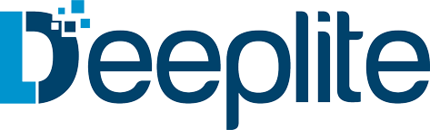
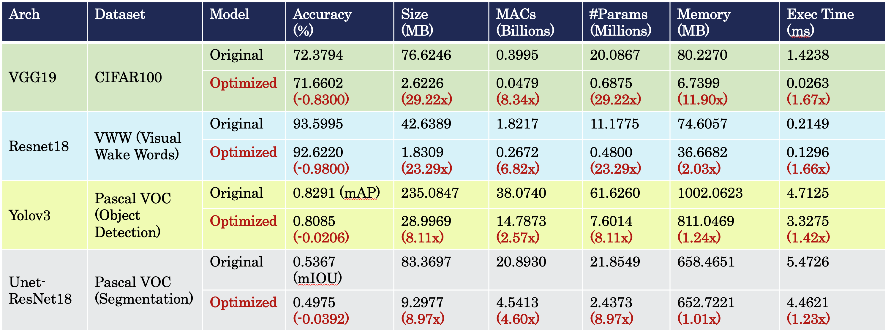

<p align="center">
  
</p>

# Deeplite Neutrino™

With the emergence of deep learning on mobile and embedded devices, AI solutions must satisfy strict computing requirements,
which often limits performance and prevents people from moving to these devices. Deeplite created Neutrino,
an intelligent optimization engine for Deep Neural Networks (DNNs) deployed on cloud servers and edge devices.
Neutrino helps AI experts automatically optimize high-performance DNN models to satisfy target computation constraints.
The engine inputs large, initial DNN models and constraints to produce smaller, highly-efficient models that meet these constraints.

Contents

- [Documentation](#Documentation)
- [Why Neutrino™](#Why-Neutrino™-?)
- [Installation](#Installation)
- [Get Your Free Community License](#Get-Your-Free-Community-License)
- [Examples](#Examples)
- [Deeplite Torch Zoo](#Deeplite-Torch-Zoo)
- [Deeplite Profiler](#Deeplite-Profiler)

# Documentation

* [Latest Release](https://neutrino.deeplite.ai/documentation/index.html)


# Why Neutrino™ ?

Neutrino™ is a deep learning library for optimizing and accelerating deep neural networks to make them faster, smaller and more power efficient. Neural network designers can specify a variety of pre-trained models, datasets and target computation constraints and ask the engine to optimize the network. High-level APIs are provided to make the optimization process easy and transparent to the user. Neutrino™ can be biased to concentrate on compression (relative to disk size taken by the model) or latency (forward call’s execution time) optimization.

A quick glance on the results obtained using Deeplite Neutrino™ can be found in the table below. While optimizing the models, a maximum affordable drop in the performance is provided as input `delta`. For classification models, the `delta` is set to 1%, while for objection detection (OD) and segmentation models, the `delta` is set to `0.03` mAP and `0.05` mIOU, respectively. We can observe that with such low (_and, almost negligble_) drop in the performance, the classification models can be optimized upto `~30x` of its original size, while OD and segmentation models can be optimized upto `~8x` of its original size.

<p align="center">
  
</p>

# Community Release

Our community edition, provides many important features to experience the usability and the optimization power of Neutrino. Community edition is primarily targetted to verify the smooth integration of Neutrino into the existing process and pipeline of various products. Feel `free` to use it! The aim of the community edition is multi-fold, as follows:

- Users could hands-on experience the power and capacity of model architecture optimization achieved using `Deeplite Neutrino`
- Users could compare the performance obtained using `Deeplite Neutrino` with other open-source and industry model architecture optimization frameworks
- Users could export an optimized model to test integration with their end applications
- Users could verify the integration of `Deeplite Neutrino` with their business-as-usual
- Users could use `Deeplite Neutrino` to accelerate academic research and report results in research papers
- Users could just play around with `Deeplite Neutrino` and enjoy the usability of model architecure optimization in various use-cases 

For detailed comparison of features on our community and production editions, refer to the [documentation](https://neutrino.deeplite.ai/documentation/features.html)

# Installation

Use ``pip`` to install `neutrino-engine` from PyPi repository. We recommend creating a new python virtualenv, then pip install using the following commands.

```{.python}
    pip install --upgrade pip
    pip install neutrino-engine
    pip install neutrino-torch
```

For other methods of installation and detailed instructions, refer to the [documentation](https://neutrino.deeplite.ai/documentation/install.html)

# Get Your Free Community License

The community license key is completely free-to-obtain and free-to-use. [Fill out this simple form](<https://info.deeplite.ai/community>) to obtain the license key for the Community Version of Deeplite Neutrino™.

# Examples

We provide [various examples](https://github.com/Deeplite/neutrino-examples) on how to optimize different kinds of deep learning models such as classification, object detection, and segmentation models using Deeplite Neutrino™.

For a detailed understanding of various customization parameters and setings, refer to the [documentation](https://neutrino.deeplite.ai/documentation/engine.html)

# Deeplite Torch Zoo

The ``deeplite-torch-zoo`` package is a collection of popular CNN model architectures and their benchmark datasets for PyTorch framework. The models are grouped under different benchmark datasets and also under different task types such as classification, object detection, and segmentation. The primary aim of this ``deeplite-torch-zoo`` is to boostrap applications by starting with the most suitable pretrained models. In addition, the pretrained models from ``deeplite-torch-zoo`` could be used as a good starting point for optimizing model architectures using our Deeplite Neutrino™. 

For a list of models available in Deeplite Torch Zoo and the benchmark results, refer to the [documentation](https://neutrino.deeplite.ai/documentation/zoo.html)

# Deeplite Profiler

To be able to use a deep learning model in research and production, it is essential to understand different performance metrics of the model, beyond accuracy.  ``deeplite-profiler`` helps in measuring the different performance metrics of a deep learning model. In addition to the existing metrics in the ``deeplite-profiler``, users could seamlessly contribute any custom metric to measure using the profiler. ``deeplite-profiler`` could also be used to compare the performance between two different deep learning models, for example, a teacher and a student model. ``deeplite-profiler`` currently supports PyTorch and TensorFlow Keras (v1) as two different backend frameworks.

For a list of different metrics available in the Deeplite Profiler, refer to the [documentation](https://neutrino.deeplite.ai/documentation/profiler.html)

