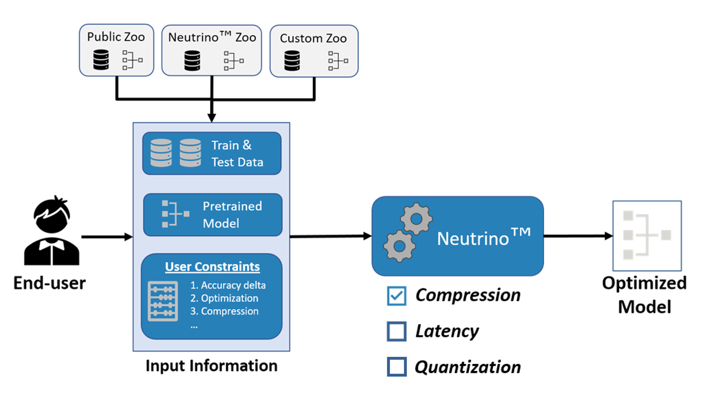

*************************
Get Started with Neutrino
*************************

Neutrino is a deep learning library for optimizing and accelerating deep neural networks to make them faster,
smaller and more energy-efficient. Neural network designers can specify a variety of pre-trained models, datasets and
target computation constraints and ask the engine to optimize the network. High-level APIs are provided to make the
optimization process easy and transparent to the user. Neutrino can be biased to concentrate on compression (relative to
disk size taken by the model) or latency (forward call's execution time) optimization.

.. note::

   Currently we support MLP/CNN-based deep learning architectures.

Follow these simple steps to learn how to use Neutrino in your project.

- :ref:`choose_framework`
- :ref:`choose_datasets`
- :ref:`choose_model`
- :ref:`run_engine`
    - :ref:`run_config`
    - :ref:`compression_config`
    - :ref:`latency_config`
    - :ref:`quant_config`
    - :ref:`export`
    - :ref:`run_output`
- :ref:`neutrino_pickle`
- :ref:`type_tasks`
- :ref:`performance`
- :ref:`env_variables`
- :ref:`code_examples`

.. _choose_framework:

Choose a Framework
==================

Neutrino supports PyTorch (and TensorFlow soon) framework. This comes as a separate package and once
installed, the framework object needs to be instantiated and given to the engine.

.. code-block:: python

    from neutrino.framework.torch_framework import TorchFramework
    framework = TorchFramework()

.. _choose_datasets:

Choose a Dataset
================

The engine expects you to provide your dataset as ``data_splits`` dictionary format from keys string names to dataloader
values. The engine always refers to ``train`` in ``data_splits`` to access training data. However, you can determine which
split is being used by engine for validation by passing  ``eval_split`` argument to the :ref:`run_config`. Alternatively, you can use one of the formatted and available benchmark datasets from :ref:`nt_zoo`.
 
Example:

.. code-block:: python

    def get_cifar100_dataset(dataroot, batch_size):
        trainset = torchvision.datasets.CIFAR100(root=dataroot,
                                                 train=True,
                                                 download=True,
                                                 transform=transforms.Compose([
                                                     transforms.RandomCrop(32, padding=4),
                                                     transforms.RandomHorizontalFlip(),
                                                     transforms.ToTensor(),
                                                     transforms.Normalize((0.4914, 0.4822, 0.4465),
                                                                          (0.2023, 0.1994, 0.2010))
                                                 ]))
        trainloader = torch.utils.data.DataLoader(trainset, batch_size=batch_size,
                                                  shuffle=True, num_workers=4, pin_memory=True)

        testset = torchvision.datasets.CIFAR100(root=dataroot,
                                                train=False,
                                                download=True,
                                                transform=transforms.Compose([
                                                    transforms.ToTensor(),
                                                    transforms.Normalize((0.4914, 0.4822, 0.4465),
                                                                         (0.2023, 0.1994, 0.2010))
                                                ]))
        testloader = torch.utils.data.DataLoader(testset, batch_size=batch_size,
                                                 shuffle=False, num_workers=4, pin_memory=True)

        return {
                'train': trainloader,
                'test': testloader
                }

.. note::

    You must use the same splits for both training and optimizing your model.
    If you use a subset of training data for validation set, you need to use the same training/validation set for
    optimization process.

.. note::

    Please use the same batch size as you have used to train the original network for the optimization process.

.. _choose_model:

Choose a Model
==============

The next step is defining the pre-trained model as the reference model you want to optimize.
You can take your own pre-trained custom model or use a model that is publicly available. We assume the model you will use
is also compatible with the framework you choose, for example a torch model will be a subclass of
``torch.nn.Module``. Alternatively, you can use one of the pretrained models from :ref:`nt_zoo`.

Example:

.. code-block:: python

    # Option 1: load a pre-trained model
    reference_model = TheModelClass(*args, **kwargs)
    reference_model.load_state_dict(torch.load(PATH))

    # Option 2: use torchvision model zoo
    import torchvision.models as models
    reference_model = models.resnet18(pretrained=True)

    # Option 3: use Neutrino zoo
    from deeplite_torch_zoo.wrappers.wrapper import get_model_by_name
    reference_model = get_model_by_name(model_name=args.arch,
                                        dataset_name=args.dataset,
                                        pretrained=True,
                                        progress=True)

.. _run_engine:

Run Optimization Engine
=======================

We provide a simple yet powerful process with multiple user-guided controls to optimize your models. 
First, you need to instantiate from ``Neutrino`` class and pass the required arguments ``data_splits``, ``reference_model`` and ``framework``.
Furthermore, a ``config`` dictionary needs to be supplied with the ``optimization`` parameter and any 
other parameters which configure the optimization and training process.

There are three optimization modes provided by neutrino: ``compression``, ``latency``, and ``quantization``. Each makes use of common Neutrino ``config`` parameters 
and other mode-specific parameters. If you are just getting started, the ``compression`` mode is our recommended first step.

.. _run_config:

Neutrino Configuration
----------------------

    You can pass several parameters to the Neutrino engine through the config. Every Neutrino job makes use of a config dictionary with parameters described below.

optimization
^^^^^^^^^^^^

    Select which optimization mode the engine should use. The engine currently supports:

    ``compression``: maximizes reduction of the bytes the model will occupy in terms of disk size
    
    ``latency``: maximizes reduction of the model execution time
    
    ``quantization``: compresses the model with quantization and reduces execution time when deployed with Deeplite RT
    
    Keep in mind compression mode may also improve latency and latency mode may reduce model size.

    .. note::
        The default behavior is **compression**. Currently, the **quantization** mode is available only for the Production version of Deeplite Neutrino. Refer, :ref:`how to upgrade <feature_comparison>`.

device
^^^^^^

    Whether to use **GPU** or **CPU** for the optimization process. This is typically the same machine you would use to train your model. For modern deep learning and computer vision models/datasets, we recommend to use GPU. 
    Keep in mind that 'device' does NOT dictate the device you deploy your model on for inference. Once you start a job, it is not possible to switch from CPU to GPU after initializing
    the engine on CPU.

use_horovod
^^^^^^^

    Activates distributed training through Horovod. Please read :ref:`run_multi_gpu` for more information.
    Neutrino will linearly scale the learning rate by the number of GPUs  

    .. important::

        Currently, the multi-GPU support is available only for the Production version of Deeplite Neutrino. Refer, :ref:`how to upgrade <feature_comparison>`.
    .. 

eval_key
^^^^^^^^

    Name of the evaluation metric the engine listens to while optimizing for `delta` (e.g. 'accuracy', 'mAP'). More details
    are here :ref:`type_tasks` and when creating customized evaluation function :ref:`deeper`.

.. code-block:: python
    
    from deeplite.torch_profiler.torch_inference import TorchEvaluationFunction

    class EvalAccuracy(TorchEvaluationFunction):
        def _compute_inference(self, model, data_loader, **kwargs):
            total_acc = ...foo accuracy calculation...
            return {'accuracy': 100. * (total_acc / float(len(data_loader)))}
    
    eval_key = 'accuracy' # matches with the dictionary key returned by EvalAccuracy()
    optimized_model = Neutrino(eval_func=EvalAccuracy(),
                               ...foo other arguments...)

eval_split
^^^^^^^^^^

    Name of the key in the `data_splits` dictionary on which to run the evaluation function and fetch
    the evaluation metric.

.. code-block:: python

    data_splits = {'train': foo_trainloader,
                   'test': foo_testloader}
    
    eval_split = 'test' # matches with the dictionary key of data_splits for validation dataset
    optimized_model = Neutrino(data=data_splits,
                               ...foo other arguments...)

.. _compression_config:

Compression Configuration
-------------------------
    The ``compression`` optimization mode makes use of the following config parameters:

.. _delta_param:

delta
^^^^^

    The acceptable performance drop for your model. Delta must be in the same range as your performance metric. For example,
    you must use a delta between 0 and 1.0 if your performance metric is between 0 and 1.0 (e.g. your model has 0.758 mAP) or
    you must use a delta between 0 and 100 if your performance metric is between 0 and 100 (e.g. 78% Top1 accuracy).

level
^^^^^
    The engine has two levels of optimization for you to control how much computing resources you want to
    allocate to the processs: Level 1 and Level 3. By default it is on level 1. Please note that level 3 may take roughly twice as long to
    complete than level 1, but level 3 will produce a more compressed result. Currently, the engine only supports level 1
    for object detection tasks.

deepsearch
^^^^^^^^^^
    In conjunction with `levels`, it is possible to use the `deepsearch` flag. This is a powerful function that will produce even more optimized results. It activates a more fine
    grained optimization search to consume the most of the allotted `delta`, however it will make the optimization process longer .

.. _latency_config:

Latency Configuration
---------------------
    The ``latency`` optimization mode makes use of the :ref:`delta_param` parameter in the same way as the ``compression`` mode.

.. _quant_config:

Quantization Configuration
--------------------------
    The quantization optimization mode is activated by adding key ``'custom_compression'`` to the config dictionary with a dictionary
    defining the quantization parameters. There are two methods for configuring quantization: rules-based quantization with ``quantization_args``
    or a layerwise configuration with ``layers`` 

quantization_args
^^^^^^^^^^^^^^^^^
    Passing a dictionary under the key ``'quant_args'`` activates rules-based model quantization. The parameters manually control
    which layers of the network are quantized to ultra low precision.

    ``'quantize_conv11'``: bool, default=False. Activates quantization of pointwise convolution layers

    ``'skip_layers'``: list[int], default=None. Skips quantization of layers with given indices. Layers indexed by traversal of computational graph of the model

    ``'skip_layers_ratio'``: float in range [0.0, 1.0], default=0.0. Skips first ``skip_layers_ratio * n_layers`` layers

.. code-block:: python

    config = {
        'custom_compression': {
            'quantization_args': {
                'quantize_conv11': True,
                'skip_layers': [8, 9, 10],
                'skip_layers_ratio': 0.1
            }
    }

layers
^^^^^^
    Passing a dictionary under the key ``'layers'`` enables a layerwise quantization configuration.
    Any layer not specified in the dictionary will remain at FP32 precision.
    The layer names are defined by the underlying framework. For torch this correlates to the names returned by ``model.named_modules()``.

    This custom_compression dictionary is formatted as follows:

.. code-block:: python
    
    config = {
        'custom_compression': {
            'layers': {
                'model.block.0.conv1': {
                    'precision': 2
                },
                'model.block.1.conv2': {
                    'precision': 2
                }...
        }
    }

.. _export:

Export
------

    A dictionary with the desired export format(s). By default, the optimized models will be exported in :ref:`neutrino_pickle`. Additionally, we support other export formats including
    `PyTorch TorchScript <https://pytorch.org/docs/stable/jit.html>`_, `ONNX <https://github.com/onnx/tutorials>`_, `Tensorflow Lite (TFLite) <https://www.tensorflow.org/lite>`_, and `dlrt`
    The optimized model can be exported to more than one format: ``['onnx', 'jit', 'tflite', 'dlrt']``. Quantized models are only exported to our proprietary `dlrt` format.
    You can also specify a customized path of the exported model file.

    .. important::

        Currently, exporting to ``jit``, ``onnx``, and ``dlrt`` is supported by default in Neutrino. If you would like to use ``tflite`` export, additionally install ``pip install deeplite-model-converter[all]``

.. _export_example:

.. code-block:: python

        'export': {
            'format': ['onnx'],
            'kwargs': {
                'root_path': <your_dir>,
                'precision': 'fp32' # ('fp32' or 'fp16'), only for onnx, dlrt formats
                'resolutions': [(32, 32), (36, 36)] # list of tuples, only for onnx, dlrt formats
            }
        }

BatchNorm Fusing
^^^^^^^^^^^^^^^^

    The engine fuses BachNorm layers before export if **bn_fusion=True**. Click `here <https://tehnokv.com/posts/fusing-batchnorm-and-conv/>`_
    for more information about Fusing batch normalization and convolution in runtime.

ONNX/DLRT Export Options
^^^^^^^^^^^^^^^^^^^^^^^^^

.. _resolution:

resolutions
+++++++++++

    By default, the onnx model is exported with both dynamic input image resolution, and fixed input resolution matching the training dataset resolution.
    If you wish to deploy the model with a different input resolution, you can specify the desired resolution(s) as shown in the export :ref:`example<export_example>`.

.. _precision:

precision
+++++++++

    Set the `'precision'` keyword argument to `'fp16'` if you want the engine to export the optimized model in FP16. Please note that some
    operations need FP32 and onnx cannot convert them to FP16. Currently, this option is only available for
    classification tasks and the onnx export format.

.. _run_output:

Output
^^^^^^

The python object of the optimized model is returned by the ``Neutrino.run()`` function call. 
The following output is obtained when the export format is provided as ``['onnx', 'jit']``. The engine exports
the reference model in FP32 and the optimized model in FP32 or FP16 (See :ref:`precision<precision>`) in **onnx format**
with both dynamic input resolution and fixed input input resolution.
The dynamic input model is also exported to **pytorch script** format and a proprietary **Neutrino pickle** format, as follows:

.. code-block:: console

    Reference Model has been exported to Neutrino pickle format: /WORKING_DIR/ref_model.pkl
    Reference Model has been exported to pytorch jit format: /WORKING_DIR/ref_model_jit.pt
    Reference Model has been exported to onnx format: /WORKING_DIR/ref_modelfp32_dynamic_shape.onnx
    Reference Model, fixed input resolution, exported to onnx format: /WORKING_DIR/ref_modelfp32_dynamic_shape.onnx
    Optimized Model has been exported to Neutrino pickle format: /WORKING_DIR/opt_model.pkl
    Optimized Model has been exported to pytorch jit format: /WORKING_DIR/opt_model_jit.pt
    Optimized Model has been exported to onnx format: /WORKING_DIR/opt_modelfp32_dynamic_shape.onnx
    Optimized Model, fixed input resolution, exported to onnx format: /WORKING_DIR/opt_model32x32fp32.onnx
    OR
    Optimized Model has been exported to onnx format: /WORKING_DIR/opt_modelfp16_dynamic_shape.onnx (if fp16 is enabled)
    Optimized Model, fixed input resolution, exported to onnx format: /WORKING_DIR/opt_model32x32fp16.onnx (if fp16 is enabled)

.. important::

    For classification models, the community version returns the second best `opt_model` at the end of the optimization process. Consider upgrading to the production version to obtain the most optimized model produced by Deeplite Neutrino. Refer :ref:`how to upgrade <feature_comparison>`.

.. important::

    For object detection and segmentation models, the community version displays the results of the optimization process, including all the optimized metric values. To obtain the optimized model produced by Deeplite Neutrino, consider upgrading to the production version. Refer :ref:`how to upgrade <feature_comparison>`.

.. _neutrino_pickle:

Neutrino Pickle Format
^^^^^^^^^^^^^^^^^^^^^^

Neutrino saves, on the disk, both the provided reference model and the optimized model in an encrypted proprietary pickle format. This will be available in the following paths: ``/WORKING_DIR/ref_model.pkl`` and ``/WORKING_DIR/opt_model.pkl``. One can load the **Neutrino pickle** format using our custom load function, as follows,

.. code-block:: python

    from neutrino.framework.torch_framework import TorchFramework
    from neutrino.job import Neutrino

    # load original model
    original_model = TheModelClass(*args, **kwargs)

    # load Neutrino pickle format model
    pytorch_optimized_model = Neutrino.load_from_pickle(TorchFramework(),
                                                        '/WORKING_DIR/opt_model.pkl',
                                                        original_model)

The ``Neutrino.load_from_pickle`` function will load the model in pickle format and return a Pytorch native object. This model can be used for further processing using **Neutrino**, or for profiling using **Deeplite Profiler**, or for any downstream applications. 

Running a Job
-------------

Finally, you just need to call `run` function from ``Neutrino`` class to start the optimization process.

.. code-block:: python

    from neutrino.framework.torch_framework import TorchFramework
    from neutrino.job import Neutrino
    config = {
        'deepsearch': args.deepsearch, #(boolean), (default = False)
        'bn_fusion':args.bn_fuse #(boolean)
        'delta': args.delta, #(between 0 to 100), (default = 1)
        'device': args.device, # 'GPU' or 'CPU' (default = 'GPU')
        'use_horovod': args.horovod, #(boolean), (default = False)
        'level': args.level, # int {1, 3}, (default = 1)
        'export':{'format': ['onnx'], # ['onnx', 'jit', 'tflite'] (default = None) 
                  'kwargs': {'precision': precision}, # ('fp16' or 'fp32') (default = 'fp32')
                 }
    }

    data_splits = {'train': trainloader,
                   'test': testloader}

    reference_model = TheModelClass(*args, **kwargs)
    reference_model.load_state_dict(torch.load(PATH))

    opt_model = Neutrino(framework=TorchFramework(),
                         data=data_splits,
                         model=reference_model,
                         config=config).run(dryrun=args.dryrun) #dryrun is boolean and it is False by default

.. note::

    It is recommended to run the engine in ``dryrun mode`` to check everything runs properly on your machines.
    It forces the engine to run till the end without running any heavy and time consuming computation.

.. _type_tasks:

Types of Tasks
==============

By default, Neutrino is wired for optimizing a classification task that has a fairly simple setup. This imposes tight constraints
on the assumed structure of how tensors flow from the data loader, to the model, to the loss function and to the evaluation.
For example, the classification task assumes the loss is CrossEntropy, the evaluation is GetAccuracy and the **eval_key**
in the ``config`` is 'accuracy'.
For more details and how to use Neutrino on more intricate tasks, please read :ref:`deeper`.

.. _performance:

Performance Considerations
==========================

.. important::

    **The optimization process may take several hours depending on the model complexity, constraints and dataset.**

* **Tighter constraints** make the optimization process harder. For instance, it is harder to find a good optimized model with *delta=%1* comparing to *delta=%5*. This is due to the nature of optimization process, where there are less possible solutions under tighter constraints. Therefore, the engine needs more time to explore and find those solutions.

* **Dataset size** also impacts on the optimization time. High resolution images or large datasets may slow down the optimization process.

* **Number of classes** in dataset can impact the optimization process. When we have more classes, we need to use more capacity of the network to learn, which means less opportunity to shrink the network.

* **Model complexity** can also impact on the optimization time as well.

.. _env_variables:

Environment Variables
=====================

Optional environment variables that can be set to configure the Neutrino engine.

* ``NEUTRINO_HOME``- The absolute path to the directory where the engine stores its data (such as checkpoints, logs, etc.) [default=~/.neutrino]
* ``NEUTRINO_LICENSE``- Contains the license key.
* ``NEUTRINO_LICENSE_FILE``- The absolute path where the license file can be found.

.. _code_examples:

Code Examples
=============

To make it quick and easy for you to test Neutrino, we provide some pre-defined scenarios. It is recommended to run the :ref:`example codes <torch_samples>`
on different pre-defined models/dataset to ensure the engine works on your machines before you optimize your custom model/dataset.
