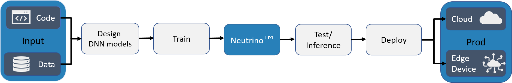

.. Neutrino documentation master file, created by
   sphinx-quickstart on Tue Mar 12 22:56:07 2019.
   You can adapt this file completely to your liking, but it should at least
   contain the root `toctree` directive.

.. _neutrino_engine:

Deeplite Neutrino™ 
==================

With the emergence of deep learning on mobile and embedded devices, AI solutions must satisfy strict computing requirements,
which often limits performance and prevents people from moving to these devices. Deeplite created Neutrino,
an intelligent optimization engine for Deep Neural Networks (DNNs) deployed on cloud servers and edge devices.
Neutrino helps AI experts automatically optimize high-performance DNN models to satisfy target computation constraints.
The engine inputs large, initial DNN models and constraints to produce smaller, highly-efficient models that meet these constraints.

.. toctree::
   :caption: Table of Contents:
   :maxdepth: 2

   features
   install
   license
   engine
   deeper
   samples
   zoo
   profiler
   
   