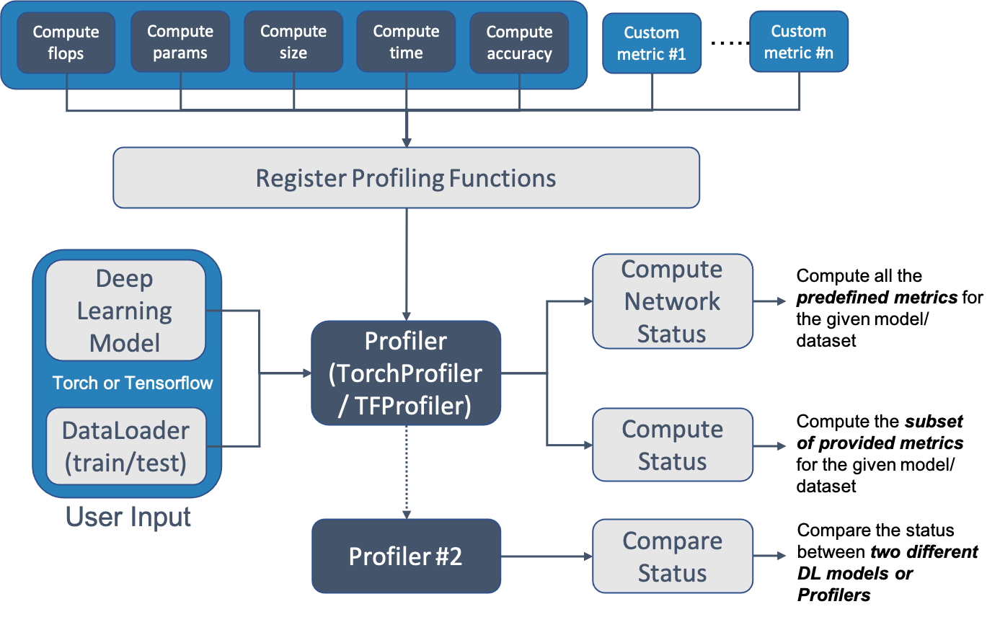

.. _profiler:

*****************
deeplite-profiler
*****************

To be able to use a deep learning model in research and production, it is essential to understand different performance metrics of the model beyond just the model's accuracy.  ``deeplite-profiler`` helps to easily and effectively measure the different performance metrics of a deep learning model. In addition to the existing metrics in the ``deeplite-profiler``, users could seamlessly contribute any custom metric to measure using the profiler. ``deeplite-profiler`` could also be used to compare the performance between two different deep learning models, for example, a teacher and a student model. ``deeplite-profiler`` currently supports PyTorch and TensorFlow Keras (v1) as two different backend frameworks.

* :ref:`profiler_install`
    * :ref:`profiler_install_pip`
    * :ref:`profiler_install_source`
    * :ref:`profiler_install_dev`
* :ref:`profiler_usage`
    * :ref:`profiler_usage_pytorch`
    * :ref:`profiler_usage_tf`
    * :ref:`profiler_usage_output`
* :ref:`profiler_examples`
    * :ref:`profiler_examples_torch`
    * :ref:`profiler_examples_tf`
* :ref:`profiler_contribute`
    * :ref:`statuskey`
    * :ref:`profilerfunction`
    * :ref:`profilerclass`

.. _profiler_install:

Installation
============

.. _profiler_install_pip:

1. Install using pip
--------------------

Use following command to install the package from our internal PyPI repository. 

.. code-block:: console

    $ pip install --upgrade pip
    $ pip install deeplite-profiler[`backend`]

.. _profiler_install_source:

2. Install from source
----------------------

.. code-block:: console

    $ git clone https://github.com/Deeplite/deeplite-profiler.git
    $ pip install .[`backend`]

One can install specific ``backend`` modules, depending on the required framework and compute support. ``backend`` could be one of the following values
    - ``torch``: to install a ``torch`` specific profiler
    - ``tf``: to install a ``TensorFlow`` specific profiler (this supports only CPU compute)
    - ``tf-gpu``: to install a ``TensorFlow-gpu`` specific profiler (this supports both CPU and GPU compute)
    - ``all``: to install both ``torch`` and ``TensorFlow`` specific profiler (this supports only CPU compute for TensorFlow)
    - ``all-gpu``: to install both ``torch`` and ``TensorFlow-gpu`` specific profiler (for GPU environment) (this supports both CPU and GPU compute for TensorFlow)

.. _profiler_install_dev:

3. Install in Dev mode
----------------------

.. code-block:: console

    $ git clone https://github.com/Deeplite/deeplite-profiler.git
    $ pip install -e .[`backend`]
    $ pip install -r requirements-test.txt

To test the installation, one can run the basic tests using `pytest` command in the root folder.

.. note::

    Currently, we support TensorFlow 1.14 and 1.15 versions, for Python 3.6 and 3.7. We `do not` support TensorFlow for Python 3.8+.

**Minimal Dependencies**

- numpy>=1.17
- torch (if using ``PyTorch`` backend)
- tensorFlow, tensorFlow-gpu (if using ``TensorFlow`` backend)

.. _profiler_usage:

How to Use
==========

.. _profiler_usage_pytorch:

For ``PyTorch`` model
---------------------

.. code-block:: python

    # Step 1: Define native pytorch dataloaders and model
    # 1a. data_splits = {"train": train_dataloder, "test": test_dataloader}
    data_splits = /* ... load iterable data loaders ... */
    model = /* ... load native deep learning model ... */

    # Step 2: Create Profiler class and register the profiling functions
    profiler = TorchProfiler(model, data_splits, name="Original Model")
    profiler.register_profiler_function(ComputeComplexity())
    profiler.register_profiler_function(ComputeExecutionTime())
    profiler.register_profiler_function(ComputeEvalMetric(get_accuracy, 'accuracy', unit_name='%'))

    # Step 3: Compute the registered profiler metrics for the PyTorch Model
    profiler.compute_network_status(batch_size=1, device=Device.CPU, short_print=False,
                                                    include_weights=True, print_mode='debug')

    # Step 4: Compare two different models or profilers.
    profiler2 = profiler.clone(model=deepcopy(model)) # Creating a dummy clone of the current profiler
    profiler2.name = "Clone Model"
    profiler.compare(profiler2, short_print=False, batch_size=1, device=Device.CPU, print_mode='debug')

.. _profiler_usage_tf:

For ``TensorFlow`` model
------------------------

.. code-block:: python

    # Step 1: Define native TensorFlow dataloaders and model
    # 1a. data_splits = {"train": train_dataloder, "test": test_dataloader}
    data_splits = /* ... load iterable data loaders ... */
    model = /* ... load native deep learning model ... */

    # Step 2: Create Profiler class and register the profiling functions
    profiler = TFProfiler(model, data_splits, name="Original Model")
    profiler.register_profiler_function(ComputeFlops())
    profiler.register_profiler_function(ComputeSize())
    profiler.register_profiler_function(ComputeParams())
    profiler.register_profiler_function(ComputeLayerwiseSummary())
    profiler.register_profiler_function(ComputeExecutionTime())
    profiler.register_profiler_function(ComputeEvalMetric(get_accuracy, 'accuracy', unit_name='%'))

    # Step 3: Compute the registered profiler metrics for the TensorFlow Keras Model
    profiler.compute_network_status(batch_size=1, device=Device.CPU, short_print=False,
                                                    include_weights=True, print_mode='debug')

    # Step 4: Compare two different models or profilers.
    profiler2 = profiler.clone(model=model) # Creating a dummy clone of the current profiler
    profiler2.name = "Clone Model"
    profiler.compare(profiler2, short_print=False, batch_size=1, device=Device.CPU, print_mode='debug')

.. _profiler_usage_output:

Output Display
--------------
An example output of the ``deeplite-profiler`` for ``resnet18`` model using the standard ``CIFAR100`` dataset using ``PyTorch`` backend, looks as follows

.. code-block:: RST

    +---------------------------------------------------------------+
    |                    Neutrino Model Profiler                    |
    +-----------------------------------------+---------------------+
    |             Param Name (Original Model) |                Value|
    |                   Backend: TorchBackend |                     |
    +-----------------------------------------+---------------------+
    |                   Evaluation Metric (%) |              76.8295|
    |                         Model Size (MB) |              42.8014|
    |     Computational Complexity (GigaMACs) |               0.5567|
    |             Total Parameters (Millions) |              11.2201|
    |                   Memory Footprint (MB) |              48.4389|
    |                     Execution Time (ms) |               2.6537|
    +-----------------------------------------+---------------------+

- **Evaluation Metric:** Computed performance of the model on the given data
- **Model Size:** Memory consumed by the parameters (weights and biases) of the model
- **Computational Complexity:** Summation of Multiply-Add Cumulations (MACs) per single image (batch_size=1)
- **#Total Parameters:** Total number of parameters (trainable and non-trainable) in the model
- **Memory Footprint:** Total memory consumed by parameters and activations per single image (batch_size=1)
- **Execution Time:** On `NVIDIA TITAN V <https://www.nvidia.com/en-us/titan/titan-v/>`_ GPU, time required for the forward pass per single image (batch_size=1)

.. _profiler_examples:

Examples
========

A list of different examples to use ``deeplite-profiler`` to profiler different PyTorch and TensorFlow models can be found `here <https://github.com/Deeplite/deeplite-profiler/tree/master/examples>`_.

.. _profiler_examples_torch:

Torch Example
-------------

.. code-block:: python

    from neutrino_torch_zoo.wrappers.wrapper import get_data_splits_by_name, get_model_by_name
    from neutrino.framework.torch_profiler.torch_profiler import TorchProfiler
    from neutrino.framework.torch_profiler.torch_profiler import *
    from neutrino.framework.profiler import Device, ComputeEvalMetric
    from neutrino.framework.torch_profiler.torch_inference import get_accuracy
    from copy import deepcopy

    # Step 1: Define pytorch dataloaders and model
    # 1a. data_splits = {"train": train_dataloder, "test": test_dataloader}
    data_splits = get_data_splits_by_name(dataset_name='cifar100',
                                                                data_root='',
                                                                batch_size=128,
                                                                num_torch_workers=4)
                                                            
    # 1b. Load the Pytorch model
    model = get_model_by_name(model_name='resnet18',
                                dataset_name='cifar100',
                                pretrained=True,
                                progress=True)

    # Step 2: Create Profiler class and register the profiling functions
    data_loader = TorchProfiler.enable_forward_pass_data_splits(data_splits)
    profiler = TorchProfiler(model, data_loader, name="Original Model")
    profiler.register_profiler_function(ComputeComplexity())
    profiler.register_profiler_function(ComputeExecutionTime())
    profiler.register_profiler_function(ComputeEvalMetric(get_accuracy, 'accuracy', unit_name='%'))

    # Step 3: Compute the registered profiler metrics for the PyTorch Model
    profiler.compute_network_status(batch_size=1, device=Device.GPU, short_print=False,
                                                    include_weights=True, print_mode='debug')

    # Step 4: Clone and Compare 
    profiler2 = profiler.clone(model=deepcopy(model))
    profiler2.name = "Clone Model"
    profiler2.compare(profiler, short_print=False, batch_size=1, device=Device.GPU, print_mode='debug')

Output of the above code is as follows:

.. include:: _static/text/torch_profiler_output.txt
    :literal:

.. _profiler_examples_tf:

TensorFlow Example
------------------

.. code-block:: python

    import numpy as np
    import TensorFlow as tf
    tf.compat.v1.logging.set_verbosity(tf.compat.v1.logging.ERROR)
    try:
        tf.compat.v1.enable_eager_execution()
    except Exception:
        pass

    from neutrino.framework.tf_profiler.tf_profiler import TFProfiler
    from neutrino.framework.tf_profiler.tf_profiler import *
    from neutrino.framework.profiler import Device, ComputeEvalMetric
    from neutrino.framework.tf_profiler.tf_inference import get_accuracy, get_missclass

    # Step 1: Define TensorFlow dataloaders and model (tf.data.Dataset)
    # 1a. data_splits = {"train": train_dataloder, "test": test_dataloader}
    (x_train, y_train), (x_test, y_test) = tf.keras.datasets.cifar100.load_data()
    x_train = x_train.astype('float32') / 255
    x_test = x_test.astype('float32') / 255    
    y_train = np.eye(100)[y_train.reshape(-1)]
    y_test = np.eye(100)[y_test.reshape(-1)]
    train_dataset = tf.data.Dataset.from_tensor_slices((x_train, y_train)) \
            .shuffle(buffer_size=x_train.shape[0]) \
            .batch(128) 
    test_dataset = tf.data.Dataset.from_tensor_slices((x_test, y_test)) \
            .batch(128) 
    data_splits = {'train': train_dataset, 'test': test_dataset}

    # 1b. Load the TensorFlow Keras model: Transfer learning from pretrained model
    preprocess_input = tf.keras.applications.mobilenet_v2.preprocess_input#tf.keras.applications.vgg19.preprocess_input
    base_model = tf.keras.applications.VGG19(input_shape=(32, 32, 3),
                                                include_top=False,
                                                weights='imagenet')
    inputs = tf.keras.Input(shape=(32, 32, 3))
    x = preprocess_input(inputs)
    x = base_model(x, training=False)
    x = tf.keras.layers.GlobalAveragePooling2D()(x)
    x = tf.keras.layers.Dropout(0.2)(x)
    outputs = tf.keras.layers.Dense(100)(x)
    model = tf.keras.Model(inputs, outputs)
    model.compile(loss=tf.keras.losses.CategoricalCrossentropy(), optimizer=tf.keras.optimizers.SGD(), metrics=['accuracy'])

    # Step 2: Create Profiler class and register the profiling functions
    data_loader = TFProfiler.enable_forward_pass_data_splits(data_splits)
    profiler = TFProfiler(model, data_loader, name="Original Model")
    profiler.register_profiler_function(ComputeFlops())
    profiler.register_profiler_function(ComputeSize())
    profiler.register_profiler_function(ComputeParams())
    profiler.register_profiler_function(ComputeLayerwiseSummary())
    profiler.register_profiler_function(ComputeExecutionTime())
    profiler.register_profiler_function(ComputeEvalMetric(get_accuracy, 'accuracy', unit_name='%'))

    # Step 3: Compute the registered profiler metrics for the TensorFlow Keras Model
    profiler.compute_network_status(batch_size=1, device=Device.GPU, short_print=False,
                                                    include_weights=True, print_mode='debug')

Output of the above code is as follows:

.. include:: _static/text/tf_profiler_output.txt
    :literal:

.. _profiler_contribute:

Contribute a Custom Metric
==========================

.. note::

    If you looking for an SDK documentation, please head over `here <https://deeplite.github.io/deeplite-profiler/>`_.

The following section describes a conceptual overview on the workings of ``deeplite-profiler``. This help in adding and/or contributing custom performance metrics while profiling deep learning models. The core of ``deeplite-profiler`` is made up of three main classes, ``Profiler`` itself, ``ProfilerFunction`` and ``StatusKey``. To be able to use a custom profiling metric, the following three steps must be performed:

#. :ref:`statuskey`
#. :ref:`profilerfunction`
#. :ref:`profilerclass`

.. _statuskey:

Create a new `StatusKey`
------------------------

Consider a custom metric to be profiled. All the properties of this metric are captured in the ``StatusKey`` class and
its children. From the ``Profiler``'s perspective, think of a ``StatusKey`` as a bit more fancy
``dict`` entry. Thus, ``StatusKey`` requires a hashable key and will be assigned a value after its associated ``ProfilerFunction`` computes it. Its hashable key (usually a ``str``) is the
class attribute ``NAME``.

Its most used abstract child is the ``Metric`` class. A metric object is composed of five methods:

* ``description``, a string description of the metric to be computed
* ``friendly_name``, a human friendly name as opposed to the hashable key. For example, `Computational Complexity` is a human friendly name as opposed to `flops` being the hashable key.
* ``get_units``, units for the measuring themetric. For example, the unit of size is `bytes`, the unit of accuracy is `%`,  and the unit of execution time is `seconds`
* ``get_comparative``, a way to compare two metrics together. It captures the sense of better or worse. For example,
  `flops` should be smaller, `accuracy` should be higher. Refer to this enum `Comparitive <https://github.com/Deeplite/deeplite-profiler/blob/c5ed2d0033311630387a9cc8c41307ada3cdda52/deeplite/profiler/metrics.py#L8>`_ for more information.
* ``get_value``, how to report the value of the metric, and is often used to take care of the scaling in the value. For example, it might be better to report "1 megabytes" rather than "1000000 bytes"

Understandably, these methods have been designed for displaying and reporting the values in mind. This is essential for achieving and presenting a good, readable output of the profiled metrics. 

An example ``Metric`` is shown below. A list of other existing ``Metrics`` in ``deeplite-profiler`` can be `here <https://github.com/Deeplite/deeplite-profiler/blob/master/deeplite/profiler/metrics.py>`_.

.. code-block:: python

    class Flops(Metric):
        NAME = 'flops'

        @staticmethod
        def description():
            return "Summation of Multiply-Add Cumulations (MACs) per single image (batch_size=1)"

        @staticmethod
        def friendly_name():
            return 'Computational Complexity'

        def get_comparative(self):
            return Comparative.RECIPROCAL

        def get_value(self):
            if self.value > 1e-3:
                return self.value
            if self.value > 1e-6:
                return self.value * 1024
            return self.value * (1024 ** 2)

        def get_units(self):
            if self.value > 1e-3:
                return 'GigaMACs'
            if self.value > 1e-6:
                return 'MegaMACs'
            return 'KiloMACs'

.. _profilerfunction:

Write a `ProfilerFunction`
--------------------------

The job of the ``ProfilerFunction`` class is to compute the ``StatusKey``. This is a function and therefore a callable which will be called by the ``Profiler`` upon a status request. There are two things to know about this object, 

* First, it needs to inform the profiler which ``StatusKey`` it is currently computing. A ``ProfilerFunction`` **can** compute more than one ``StatusKey``. This information is provided by the return tuple of its ``get_bounded_status_key`` method.

* Second, its ``__call__`` signature does not have full arbitrary freedom of any callable. Indeed, since the ``Profiler`` object does not know in advance which functions it will have, it tries to magically pipe arguments to the correct functions. Therefore, the ``__call__`` signature of a ``ProfilerFunction`` instance cannot have \*args or \*\*kwargs in it. It is very important to note, that the **instance** of ``ProfilerFunction`` cannot have \*\*kwargs. The emphasis is on the instance because it allows at least to have mid level interfaces that can contain \*args and \*\*kwargs since they wont be instantiated.

Some example ``ProfilerFunction`` written in PyTorch can be found `here <https://github.com/Deeplite/deeplite-profiler/blob/master/deeplite/torch_profiler/torch_profiler.py>`_  and some examples written in TensorFlow can be found `here <https://github.com/Deeplite/deeplite-profiler/blob/master/deeplite/tf_profiler/tf_profiler.py>`_

.. _profilerclass:

Registering with the `Profiler`
-------------------------------

A ``Profiler`` object is originally empty. One needs to register ``ProfilerFunction`` in order to start
using it. Registering functions will build the internal dict-like structure that maps ``StatusKey`` to
``ProfilerFunction``. The method ``register_profiler_function`` also exhibits an optional `override`
parameter. This is to make sure the ``ProfilerFunction`` you are currently registering takes precedence
over previously registered functions.

For example, a ``Profiler`` object is instantiated and all the default functions are registered. In your custom project, you have a special case for computing the model size. You can simply register it with ``override=True`` and this will be taken to compute the model size instead. However, this will raise an error if you are registering against another function
with ``override=True`` over model size since there is now an ambiguous priority clash.

As an example, for using PyTorch a ``ProfilerFunction`` can be registered as follows,

.. code-block:: python

    profiler = TorchProfiler(model, data_loader, name="Original Model")
    profiler.register_profiler_function(ComputeComplexity()) # Provide your `ProfilerFunction` here

Compute status
^^^^^^^^^^^^^^

The main method to be implemented is the ``compute_status``, which requires a valid ``StatusKey``
an argument and any additional arguments to be passed to the relevant ``ProfilerFunction``. Valid here really just means that there was a function registered where its ``get_bounded_status_key`` returned a ``StatusKey`` with
its ``NAME`` being this valid argument.

To compute all the status at once, the class provides the method ``compute_network_status``. This
takes an arbitrary dict as \*\*kwargs as argument which are all the arguments to be passed to
every ``ProfilerFunction`` being called. This is where the limitation mentioned above on the
``__call__`` signature of said function makes sense. Internally, the ``Profiler`` does an
introspection of the signature through Python's standard module `inspect` in order to pipe
a portion of this \*\*kwargs to each function. If such a function had also \*\*kwargs, there would
be no way to know what portion of the ``compute_network_status``'s \*\*kwargs to pass.
The ``Profiler`` could not call the function unambiguously.

Compare
^^^^^^^
A popular use case is to compare two different models (for example, a teacher and a student model) and see their relative performance in terms of different metrics. ``Profiler`` has the method ``compare`` to do just that. It needs another
profiler and accepts an additional \*\*kwargs. Internally it will call ``compute_network_status`` on
both profiler and uses a display function to provide the comparison report.

Please look at some existing `examples here <https://github.com/Deeplite/deeplite-profiler/tree/master/examples>`_ showing how to register profiling functions and use them to compute network status.