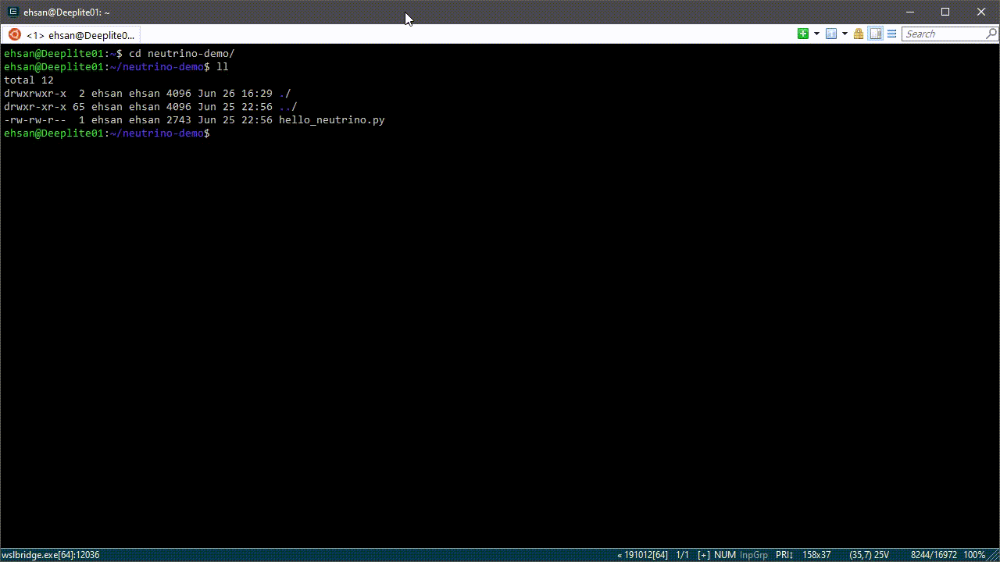

.. _torch_samples:

********
Examples
********

Make sure you have installed :ref:`neutrino-engine <pypi_install_engine>`, :ref:`neutrino-torch <pypi_install_engine>`
and :ref:`deeplite-torch-zoo <pypi_install_engine>` packages successfully. Simply create ``hello_neutrino.py`` file and copy the following
sample code. This sample uses :ref:`deeplite_torch_zoo <nt_zoo>` package to make it easier for you to run Neutrino on
different scenarios, but nothing prevents you from providing your own sample models and datasets as well.

.. note::

    To download the sample codes, refer to our `neutrino-example <https://github.com/Deeplite/neutrino-examples>`_ repository.

- :ref:`classification_example`
- :ref:`od_example`
    - :ref:`od_ssd_example`
    - :ref:`od_yolo_example`
- :ref:`segmentation_example`
    - :ref:`segmentation_unet_example`
- :ref:`run_neutrino`
    - :ref:`run_one_gpu`
    - :ref:`run_multi_gpu`
    - :ref:`run_multi_multi_gpu`

.. _classification_example:

Classification Example
======================

.. code-block:: python

    import argparse

    from neutrino.framework.torch_framework import TorchFramework
    from neutrino.job import Neutrino
    
    from deeplite_torch_zoo.wrappers.wrapper import get_data_splits_by_name, get_model_by_name
    
    if __name__ == "__main__":
        parser = argparse.ArgumentParser()
        # model/dataset args
        parser.add_argument('--dataset', metavar='DATASET', default='cifar100', help='dataset to use')
        parser.add_argument('-r', '--data_root', metavar='PATH', default='', help='dataset data root path')
        parser.add_argument('-b', '--batch_size', type=int, metavar='N', default=128, help='mini-batch size')
        parser.add_argument('-j', '--workers', type=int, metavar='N', default=4, help='number of data loading workers')
        parser.add_argument('-a', '--arch', metavar='ARCH', default='resnet18', help='model architecture')
    
        # neutrino args
        parser.add_argument('-d', '--delta', type=float, metavar='DELTA', default=1, help='accuracy drop tolerance')
        parser.add_argument('-l', '--level', type=int, default=1, help='level', choices=(1, 2))
        parser.add_argument('-o', '--optimization', type=str, default='compression', choices=('compression', 'latency'))
        parser.add_argument('--deepsearch', action='store_true', help="to consume the delta as much as possible")
        parser.add_argument('--fp16', action='store_true', help="export to fp16 as well if it is possible")
        parser.add_argument('--dryrun', action='store_true', help="force all loops to early break")
        parser.add_argument('--horovod', action='store_true', help="activate horovod")
        parser.add_argument('--bn_fuse', action='store_true', help="fuse batch normalization layers")
        parser.add_argument('--device', type=str, metavar='DEVICE', default='GPU', help='Device to use, CPU or GPU')
    
        args = parser.parse_args()
        device_map = {'CPU': 'cpu', 'GPU': 'cuda'}
    
        data_splits = get_data_splits_by_name(dataset_name=args.dataset,
                                              data_root=args.data_root,
                                              batch_size=args.batch_size,
                                              num_torch_workers=args.workers,
                                              device=device_map[args.device])
    
        reference_model = get_model_by_name(model_name=args.arch,
                                            dataset_name=args.dataset,
                                            pretrained=True,
                                            progress=True,
                                            device=device_map[args.device])
    
        config = {'deepsearch': args.deepsearch,
                  'level': args.level,
                  'delta': args.delta,
                  'device': args.device,
                  'onnx_precision': 'fp16' if args.fp16 else 'fp32',
                  'optimization': args.optimization,
                  'use_horovod': args.horovod,
                  'bn_fusion': args.bn_fuse,
                  }
    
        optimized_model = Neutrino(framework=TorchFramework(),
                                   data=data_splits,
                                   model=reference_model,
                                   config=config).run(dryrun=args.dryrun)

.. _od_example:

Object Detection Example
========================

Before you start, make sure that you were able to run the :ref:`classification_example` without any problems, as
object detection optimization is more intricate. In the following example, you will see implementations
of some interfaces required to make a non-classification task compatible with Neutrino, as explained
in :ref:`deeper`.

.. _od_ssd_example:

SSD Family
----------

.. code-block:: python

    import argparse
    import os

    from neutrino_torch_zoo.wrappers.wrapper import get_data_splits_by_name, get_model_by_name
    from neutrino.framework.functions import LossFunction
    from neutrino.framework.torch_framework import TorchFramework
    from neutrino.framework.torch_profiler.torch_data_loader import TorchForwardPass
    from neutrino.framework.torch_profiler.torch_inference import TorchEvaluationFunction
    from neutrino.job import Neutrino
    from neutrino.nlogger import getLogger
    from neutrino_torch_zoo.wrappers.eval import yolo_eval_func
    from neutrino_torch_zoo.src.objectdetection.ssd300.model.ssd300_loss import Loss
    from neutrino_torch_zoo.src.objectdetection.ssd300.utils.utils import dboxes300_coco

    logger = getLogger(__name__)

    class SSDEval(TorchEvaluationFunction):
        def __init__(self, net, data_root):
            self.net = net
            self.data_root = data_root

        def _compute_inference(self, model, data_loader, **kwargs):
            # same eval for ssd than yolo
            return yolo_eval_func(model=model, data_root=self.data_root, _set='voc', net=self.net, img_size=300)

    class SSDLoss(LossFunction):
        def __init__(self, device='cuda'):
            self.loss_func = Loss(dboxes300_coco()).to(device)
            self.torch_device = device

        def __call__(self, model, data):
            imgs, targets, labels_length, imgs_id = data
            _img_size = imgs.shape

            imgs = imgs.to(self.torch_device)
            ploc, plabel = model(imgs)

            loss = self.loss_func.compute_loss(_img_size, targets, labels_length, ploc, plabel, device=self.torch_device)
            return loss

    if __name__ == '__main__':
        parser = argparse.ArgumentParser()
        # model/dataset args
        parser.add_argument('--voc_path', default='/neutrino/datasets/VOCdevkit/',
                            help='vockit data path contains VOC2007 and VOC2012.')
        parser.add_argument('-b', '--batch_size', type=int, metavar='N', default=8, help='mini-batch size')
        parser.add_argument('-j', '--workers', type=int, metavar='N', default=4, help='number of data loading workers')
        parser.add_argument('-a', '--arch', metavar='ARCH', default='ssd300_resnet18', help='model architecture',
                            choices=['ssd300_resnet18', 'ssd300_resnet34', 'ssd300_resnet50', 'ssd300_vgg16'])

        # neutrino args
        parser.add_argument('-d', '--delta', type=float, metavar='DELTA', default=0.05, help='accuracy drop tolerance')
        parser.add_argument('--deepsearch', action='store_true', help="to consume the delta as much as possible")
        parser.add_argument('--dryrun', action='store_true', help="force all loops to early break")
        parser.add_argument('--horovod', action='store_true', help="activate horovod")
        parser.add_argument('--device', type=str, metavar='DEVICE', default='GPU', help='Device to use, cpu or cuda',
                            choices=['GPU', 'CPU'])
        parser.add_argument('--bn_fuse', action='store_true', help="fuse batch normalization layers")

        args = parser.parse_args()
        device_map = {'CPU': 'cpu', 'GPU': 'cuda'}
        data_splits = get_data_splits_by_name(
            data_root=args.voc_path,
            dataset_name='voc',
            model_name=args.arch,
            batch_size=args.batch_size,
            num_workers=args.workers,
            device=device_map[args.device],
        )
        fp = TorchForwardPass(model_input_pattern=(0, '_', '_', '_'))

        reference_model = get_model_by_name(model_name=args.arch,
                                            dataset_name='voc_20',
                                            pretrained=True,
                                            progress=True,
                                            device=device_map[args.device])

        # eval func
        eval_key = 'mAP'
        if args.dryrun:
            def eval_func(model, data_splits):
                return {eval_key: 1}
        else:
            eval_func = SSDEval(net=args.arch, data_root=os.path.join(args.voc_path, 'VOC2007'))

        # loss
        loss_cls = SSDLoss
        loss_kwargs = {'device': device_map[args.device]}

        # custom config
        config = {'deepsearch': args.deepsearch,
                'delta': args.delta,
                'device': args.device,
                'use_horovod': args.horovod,
                'task_type': 'object_detection',
                'bn_fusion': args.bn_fuse,
                }

        optimized_model = Neutrino(TorchFramework(),
                                data=data_splits,
                                model=reference_model,
                                config=config,
                                eval_func=eval_func,
                                forward_pass=fp,
                                loss_function_cls=loss_cls,
                                loss_function_kwargs=loss_kwargs).run(dryrun=args.dryrun)

.. _od_yolo_example:

YOLO Family
-----------

.. code-block:: python

    import argparse
    import os

    from neutrino.framework.functions import LossFunction
    from neutrino.framework.torch_framework import TorchFramework
    from neutrino.framework.torch_profiler.torch_data_loader import TorchForwardPass
    from neutrino.framework.torch_profiler.torch_inference import TorchEvaluationFunction
    from neutrino.job import Neutrino
    from neutrino.nlogger import getLogger
    from neutrino_torch_zoo.wrappers.wrapper import get_data_splits_by_name, get_model_by_name
    from neutrino_torch_zoo.wrappers.eval import yolo_eval_func
    from neutrino_torch_zoo.src.objectdetection.yolov3.model.loss.yolo_loss import YoloV3Loss

    logger = getLogger(__name__)

    class YOLOEval(TorchEvaluationFunction):
        def __init__(self, net, data_root):
            self.net = net
            self.data_root = data_root

        def _compute_inference(self, model, data_loader, **kwargs):
            # silent **kwargs
            return yolo_eval_func(model=model, data_root=self.data_root, _set='voc', net=self.net)

    class YOLOLoss(LossFunction):
        def __init__(self, num_classes=20, device='cuda'):
            # when num classes is not provided to YoloV3Loss it uses 20 as the default.
            # that's okay here because the whole file assumes voc dataset for testing.
            self.criterion = YoloV3Loss(num_classes=num_classes, device=device)
            self.torch_device = device

        def __call__(self, model, data):
            imgs, targets, labels_length, imgs_id = data
            _img_size = imgs.shape[-1]

            imgs = imgs.to(self.torch_device)
            p, p_d = model(imgs)
            _, loss_giou, loss_conf, loss_cls = self.criterion(p, p_d, targets, labels_length, _img_size)

            return {'lgiou': loss_giou, 'lconf': loss_conf, 'lcls': loss_cls}

    if __name__ == '__main__':
        parser = argparse.ArgumentParser()
        # model/dataset args
        parser.add_argument('--voc_path', default='/neutrino/datasets/VOCdevkit/',
                            help='vockit data path contains VOC2007 and VOC2012.')
        parser.add_argument('-b', '--batch_size', type=int, metavar='N', default=8, help='mini-batch size')
        parser.add_argument('-j', '--workers', type=int, metavar='N', default=4, help='number of data loading workers')
        parser.add_argument('-a', '--arch', metavar='ARCH', default='yolo3', help='model architecture', choices=['yolo3'])

        # neutrino args
        parser.add_argument('-d', '--delta', type=float, metavar='DELTA', default=0.05, help='accuracy drop tolerance')
        parser.add_argument('--deepsearch', action='store_true', help="to consume the delta as much as possible")
        parser.add_argument('--dryrun', action='store_true', help="force all loops to early break")
        parser.add_argument('--horovod', action='store_true', help="activate horovod")
        parser.add_argument('--device', type=str, metavar='DEVICE', default='GPU', help='Device to use, CPU or GPU',
                            choices=['GPU', 'CPU'])
        parser.add_argument('--bn_fuse', action='store_true', help="fuse batch normalization layers")
        args = parser.parse_args()
        device_map = {'CPU': 'cpu', 'GPU': 'cuda'}

        data_splits = get_data_splits_by_name(
            data_root=args.voc_path,
            dataset_name='voc',
            model_name=args.arch,
            batch_size=args.batch_size,
            num_workers=args.workers,
            device=device_map[args.device],

        )
        fp = TorchForwardPass(model_input_pattern=(0, '_', '_', '_'))

        reference_model = get_model_by_name(model_name=args.arch,
                                            dataset_name='voc_20',
                                            pretrained=True,
                                            progress=True,
                                            device=device_map[args.device],)

        # eval func
        eval_key = 'mAP'
        if args.dryrun:
            def eval_func(model, data_splits):
                return {eval_key: 1}
        else:
            eval_func = YOLOEval(net=args.arch, data_root=os.path.join(args.voc_path, 'VOC2007'))

        # loss
        loss_cls = YOLOLoss
        loss_kwargs = {'device': device_map[args.device]}

        # custom config
        config = {'deepsearch': args.deepsearch,
                'delta': args.delta,
                'device': args.device,
                'use_horovod': args.horovod,
                'task_type': 'object_detection',
                'bn_fusion': args.bn_fuse,
                }

        optimized_model = Neutrino(TorchFramework(),
                                data=data_splits,
                                model=reference_model,
                                config=config,
                                eval_func=eval_func,
                                forward_pass=fp,
                                loss_function_cls=loss_cls,
                                loss_function_kwargs=loss_kwargs).run(dryrun=args.dryrun)

.. _segmentation_example:

Segmentation Example
====================

.. _segmentation_unet_example:

UNet family
-----------

.. code-block:: python

    import argparse
    import os
    import torch
    import torch.nn as nn

    from neutrino.framework.functions import LossFunction
    from neutrino.framework.torch_framework import TorchFramework
    from neutrino.framework.torch_nn import NativeOptimizerFactory, NativeSchedulerFactory
    from neutrino.framework.profiler import Device
    from neutrino.framework.torch_profiler.torch_data_loader import TorchForwardPass
    from neutrino.framework.torch_profiler.torch_inference import TorchEvaluationFunction
    from neutrino.job import Neutrino
    from neutrino.nlogger import getLogger

    from neutrino_torch_zoo.wrappers.wrapper import get_data_splits_by_name, get_model_by_name
    from neutrino_torch_zoo.wrappers.models.segmentation.unet import unet_carvana
    from neutrino_torch_zoo.wrappers.eval import seg_eval_func

    from neutrino_torch_zoo.src.segmentation.unet_scse.repo.src.losses.multi import MultiClassCriterion
    from neutrino_torch_zoo.src.segmentation.unet_scse.repo.src.utils.scheduler import CosineWithRestarts
    from neutrino_torch_zoo.src.segmentation.unet_scse.repo.src.losses.multi import MultiClassCriterion
    from neutrino_torch_zoo.src.segmentation.fcn.solver import cross_entropy2d

    logger = getLogger(__name__)

    class UNetEval(TorchEvaluationFunction):
        def __init__(self, model_type):
            self.model_type = model_type
            self.eval_func = seg_eval_func

        def _compute_inference(self, model, data_loader, **kwargs):
            # silent **kwargs
            data_loader = data_loader.native_dl
            return self.eval_func(model=model, data_loader=data_loader, net=self.model_type)

    class UNetLoss(LossFunction):
        def __init__(self, net, device='cuda'):
            self.torch_device = device
            if net == 'unet':
                self.criterion = nn.BCEWithLogitsLoss()
            elif 'unet_scse_resnet18' in net:
                self.criterion = MultiClassCriterion(loss_type='Lovasz', ignore_index=255)
            else:
                raise ValueError

        def __call__(self, model, data):
            imgs, true_masks, _ = data
            true_masks = true_masks.to(self.torch_device)

            imgs = imgs.to(self.torch_device)
            masks_pred = model(imgs)
            loss = self.criterion(masks_pred, true_masks)

            return {'loss': loss}

    class UNetNativeOptimizerFactory(NativeOptimizerFactory):
        def __init__(self):
            self.lr = 0.001
            self.momentum = 0.9
            self.weight_decay = 1e-8

        def make(self, native_model):
            return torch.optim.RMSprop(native_model.parameters(), lr=self.lr, weight_decay=self.weight_decay,
                                    momentum=self.momentum)

    class UNetNativeSchedulerFactory(NativeSchedulerFactory):
        def make(self, native_optimizer):
            return torch.optim.lr_scheduler.ReduceLROnPlateau(native_optimizer, 'max', patience=10)

    if __name__ == '__main__':
        parser = argparse.ArgumentParser()
        # model/dataset args
        parser.add_argument('--dataset', choices={'carvana', 'voc'}, default='voc',
                            help="Choose whether to use carvana or voc dataset. The model's architecture will be chosen accordingly.")
        parser.add_argument('--voc', default='/neutrino/datasets/', help='voc data path.')
        parser.add_argument('--carvana', default='/neutrino/datasets/carvana/', help='carvana data path.')
        parser.add_argument('-b', '--batch_size', type=int, metavar='N', default=4, help='mini-batch size')
        parser.add_argument('-j', '--workers', type=int, metavar='N', default=4, help='number of data loading workers')
        parser.add_argument('--num_classes', type=int, default=20, help='number of classes to use (only for voc)')

        # neutrino args
        parser.add_argument('-d', '--delta', type=float, metavar='DELTA', default=0.02, help='metric drop tolerance')
        parser.add_argument('--deepsearch', action='store_true', help="to consume the delta as much as possible")
        parser.add_argument('--dryrun', action='store_true', help="force all loops to early break")
        parser.add_argument('--horovod', action='store_true', help="activate horovod")
        parser.add_argument('--device', type=str, metavar='DEVICE', default='GPU',
                            help='Device to use, CPU or GPU (however locked to GPU for now)',
                            choices=['GPU', 'CPU'])
        parser.add_argument('--bn_fuse', action='store_true', help="fuse batch normalization layers")

        args = parser.parse_args()
        device_map = {'CPU': 'cpu', 'GPU': 'cuda'}

        if args.dataset == 'carvana':
            print("Choosing carvana dataset")
            args.arch = 'unet'

            data_splits = get_carvana_dataset(args.carvana, args.batch_size, args.workers)
            teacher = unet_carvana(pretrained=True, progress=True)

            eval_key = 'dice_coeff'
        else:
            print("Choosing voc dataset")
            args.arch = 'unet_scse_resnet18'

            data_splits = get_data_splits_by_name(
                data_root=args.voc,
                dataset_name='voc',
                model_name=args.arch,
                batch_size=args.batch_size,
                num_classes=args.num_classes,
                num_workers=args.workers,
                backbone='vgg',
                sbd_root=None,
                device=device_map[args.device]
            )
            teacher = get_model_by_name(
                model_name=args.arch,
                dataset_name='voc_20',
                pretrained=True,
                progress=True,
                device=device_map[args.device])

            eval_key = 'miou'

        if args.dryrun:
            def eval_func(model, data_splits):
                return {eval_key: 1}
        else:
            eval_func = UNetEval(args.arch)

        framework = TorchFramework()
        fp = TorchForwardPass(model_input_pattern=(0, '_', '_'))

        # loss
        loss_cls = UNetLoss
        loss_kwargs = {'net': args.arch, 'device': device_map[args.device]}

        # custom config
        config = {'deepsearch': args.deepsearch,
                'delta': args.delta,
                'device': args.device,
                'use_horovod': args.horovod,
                'task_type': 'segmentation',
                'bn_fusion': args.bn_fuse,
                'full_trainer': {'eval_key': eval_key,
                                # uncomment these two below if you want to try other optimizer / scheduler
                                # 'optimizer': UNetNativeOptimizerFactory,
                                # 'scheduler': {'factory': UNetNativeSchedulerFactory, 'eval_based': False}
                                }
                }

        optimized_model = Neutrino(TorchFramework(),
                                data=data_splits,
                                model=teacher,
                                config=config,
                                eval_func=eval_func,
                                forward_pass=fp,
                                loss_function_cls=loss_cls,
                                loss_function_kwargs=loss_kwargs).run(dryrun=args.dryrun)

.. _run_neutrino:

Run Neutrino
============

In this section we explain how you can run the engine with classification example.

.. _run_one_gpu:

Running on a single GPU
-----------------------

You can use different datasets (such as ImageNet, CIFAR100, Visual Wake Words (VWW), subset of ImageNet, MNIST) and models (such as vgg, resnet
mobilenet, etc.) from Neutrino zoo. Please see :ref:`nt_zoo` to see the list of pre-trained models and datasets.
It is recommended to first run the sample on CIFAR100 with the default values to make sure the engine works on your servers.

To run the sample:

.. code-block:: console

    $ python hello_neutrino_classifier.py --dataset cifar100 --workers 1 -a vgg19 --delta 1 --level 2 --deepsearch --batch_size 256

The output:

.. code-block:: console

    Downloading https://www.cs.toronto.edu/~kriz/cifar-100-python.tar.gz to /WORKING_DIR/.neutrino-torch-zoo/cifar-100-python.tar.gz
    Extracting /WORKING_DIR/.neutrino-torch-zoo/cifar-100-python.tar.gz to /WORKING_DIR/.neutrino-torch-zoo
    2020-12-09 15:35:10 - INFO: Verifying license...
    2020-12-09 15:35:11 - INFO: The license is valid!
    Files already downloaded and verified
    Files already downloaded and verified
    2020-12-09 15:35:14 - INFO: Starting job with ID: 67CA3456
    2020-06-26 16:33:49 - INFO: Args: --dataset, cifar100, --workers, 1, -a, vgg19, --delta, 1, --level, 2, --deepsearch, --batch_size, 256
    2020-06-26 16:33:49 - INFO:
    +------------------------------------------------------------------------------------+
    | Neutrino 1.0.0                                                 26/06/2020 16:33:49 |
    +------------------------------------------------------------------------------------+
    2020-06-26 16:33:50 - INFO: Backend: TorchBackend
    2020-06-26 16:33:50 - INFO: Parsed task type 'classification'
    2020-06-26 16:33:52 - INFO: Trying forward passes on training data...
    2020-06-26 16:33:52 - INFO: ...Success
    2020-06-26 16:33:52 - INFO: Test dataset size: 10240 instances
    2020-06-26 16:33:52 - INFO: Train dataset size: 50176 instances
    2020-06-26 16:33:52 - INFO: Exporting to ONNX
    2020-12-09 15:35:17 - INFO: Model has been exported to pytorch jit format: /WORKING_DIR/ref_model_jit.pt
    2020-12-09 15:35:18 - INFO: Model has been exported to onnx format: /WORKING_DIR/ref_model.onnx
    2020-06-26 16:33:53 - INFO: Computing network status...
    2020-06-26 16:33:54 - INFO:
    +---------------------------------------------------------------+
    |                    Neutrino Model Profiler                    |
    +-----------------------------------------+---------------------+
    |            Param Name (Reference Model) |                Value|
    |                   Backend: TorchBackend |                     |
    +-----------------------------------------+---------------------+
    |          Evaluation Metric (accuracy %) |              72.4902|
    |                         Model Size (MB) |              76.6246|
    |     Computational Complexity (GigaMACs) |               0.3995|
    |         Number of Parameters (Millions) |              20.0867|
    |                   Memory Footprint (MB) |              80.2270|
    |                     Execution Time (ms) |               1.8288|
    +-----------------------------------------+---------------------+
    Note:
    * Evaluation Metric: Computed performance of the model on the given data
    * Model Size: Memory consumed by the parameters (weights and biases) of the model
    * Computational Complexity: Summation of Multiply-Add Cumulations (MACs) per single image (batch_size=1)
    * Number of Parameters: Total number of parameters (trainable and non-trainable) in the model
    * Memory Footprint: Total memory consumed by the parameters (weights and biases) and activations (per layer) per single image (batch_size=1)
    * Execution Time: On current device, time required for the forward pass per single image (batch_size=1)
    +---------------------------------------------------------------+
    2020-06-26 16:33:54 - INFO: Analyzing design space...
    2020-06-26 16:33:56 - INFO:
    +------------------------------------------------------------------------------------+
    |                                  Target |                           71.49 accuracy |
    +------------------------------------------------------------------------------------+
    |                           At most steps |                                        7 |
    +------------------------------------------------------------------------------------+
    |              Estimated exploration time |                    2:31:27 (d, hh:mm:ss) |
    +------------------------------------------------------------------------------------+
    2020-06-26 16:33:56 - INFO: Phase 1
    2020-06-26 16:33:56 - INFO: Step 1
    2020-06-26 16:37:25 - INFO: Starting ... [0%]
    2020-06-26 16:41:48 - INFO: Exploring .. [25%]
    2020-06-26 16:46:15 - INFO: Exploring .. [50%]
    2020-06-26 16:50:44 - INFO: Exploring .. [75%]
    2020-06-26 16:55:14 - INFO: Done ... [100%]
    2020-06-26 16:55:15 - INFO: Step 2
    2020-06-26 17:00:06 - INFO: Starting ... [0%]
    2020-06-26 17:04:17 - INFO: Exploring .. [25%]
    2020-06-26 17:08:28 - INFO: Exploring .. [50%]
    2020-06-26 17:12:40 - INFO: Exploring .. [75%]
    2020-06-26 17:16:51 - INFO: Done ... [100%]
    2020-06-26 17:16:52 - INFO: Step 3
    2020-06-26 17:21:09 - INFO: Starting ... [0%]
    2020-06-26 17:25:31 - INFO: Exploring .. [25%]
    2020-06-26 17:29:53 - INFO: Exploring .. [50%]
    2020-06-26 17:34:16 - INFO: Exploring .. [75%]
    2020-06-26 17:38:38 - INFO: Done ... [100%]
    2020-06-26 17:38:40 - INFO: Step 4
    2020-06-26 17:42:37 - INFO: Starting ... [0%]
    2020-06-26 17:47:05 - INFO: Exploring .. [25%]
    2020-06-26 17:51:32 - INFO: Exploring .. [50%]
    2020-06-26 17:55:59 - INFO: Exploring .. [75%]
    2020-06-26 18:00:25 - INFO: Done ... [100%]
    2020-06-26 18:00:26 - INFO: Phase 2
    2020-06-26 18:00:26 - INFO: Step 1
    2020-06-26 18:00:26 - INFO: Starting ... [0%]
    2020-06-26 18:04:38 - INFO: Exploring .. [25%]
    2020-06-26 18:08:50 - INFO: Exploring .. [50%]
    2020-06-26 18:13:02 - INFO: Exploring .. [75%]
    2020-06-26 18:17:14 - INFO: Done ... [100%]
    2020-06-26 18:17:16 - INFO: Step 2
    2020-06-26 18:17:16 - INFO: Starting ... [0%]
    2020-06-26 18:21:40 - INFO: Exploring .. [25%]
    2020-06-26 18:26:04 - INFO: Exploring .. [50%]
    2020-06-26 18:30:28 - INFO: Exploring .. [75%]
    2020-06-26 18:33:16 - INFO: Done ... [100%]
    2020-06-26 18:33:17 - INFO: Step 3
    2020-06-26 18:33:17 - INFO: Starting ... [0%]
    2020-06-26 18:37:46 - INFO: Exploring .. [25%]
    2020-06-26 18:42:14 - INFO: Exploring .. [50%]
    2020-06-26 18:46:43 - INFO: Exploring .. [75%]
    2020-06-26 18:46:43 - INFO: Done ... [100%]
    2020-06-26 18:46:44 - INFO: Step 4
    2020-06-26 18:46:44 - INFO: Starting ... [0%]
    2020-06-26 18:51:10 - INFO: Exploring .. [25%]
    2020-06-26 18:55:36 - INFO: Exploring .. [50%]
    2020-06-26 19:00:01 - INFO: Exploring .. [75%]
    2020-06-26 19:04:16 - INFO: Done ... [100%]
    2020-06-26 19:04:18 - INFO: Comparing networks status...
    2020-06-26 19:04:20 - INFO:
    +--------------------------------------------------------------------------------------------------------------------------+
    |                                                 Neutrino Model Profiler                                                  |
    +-----------------------------------------+--------------------------+--------------------------+--------------------------+
    |                              Param Name |               Enhancement|   Value (Optimized Model)|   Value (Reference Model)|
    |                                         |                          |     Backend: TorchBackend|     Backend: TorchBackend|
    +-----------------------------------------+--------------------------+--------------------------+--------------------------+
    |          Evaluation Metric (accuracy %) |                   -0.6543|                   71.8359|                   72.4902|
    |                         Model Size (MB) |                    28.14x|                    2.7229|                   76.6246|
    |     Computational Complexity (GigaMACs) |                     5.34x|                    0.0748|                    0.3995|
    |         Number of Parameters (Millions) |                    28.14x|                    0.7138|                   20.0867|
    |                   Memory Footprint (MB) |                     1.98x|                    3.8986|                    7.7362|
    |                     Execution Time (ms) |                     1.60x|                    0.0376|                    0.0603|
    +-----------------------------------------+--------------------------+--------------------------+--------------------------+
    Note:
    * Evaluation Metric: Computed performance of the model on the given data
    * Model Size: Memory consumed by the parameters (weights and biases) of the model
    * Computational Complexity: Summation of Multiply-Add Cumulations (MACs) per single image (batch_size=1)
    * Number of Parameters: Total number of parameters (trainable and non-trainable) in the model
    * Memory Footprint: Total memory consumed by parameters and activations per single image (batch_size=1)
    * Execution Time: On current device, time required for the forward pass per single image
    +--------------------------------------------------------------------------------------------------------------------------+
    2020-12-09 15:46:59 - INFO: The engine successfully optimized your reference model, enjoy!
    2020-12-09 15:46:59 - INFO: Exporting to Native and ONNX formats
    2020-12-09 15:46:59 - INFO: Model has been exported to pytorch jit format: /WORKING_DIR/opt_model_jit.pt
    2020-12-09 15:47:00 - INFO: Model has been exported to onnx format: /WORKING_DIR/opt_model.onnx
    2020-12-09 15:47:00 - INFO: Job with ID 67CA3456 finished
    2020-06-26 19:04:21 - INFO: Total execution time: 2:30:32 (d, hh:mm:ss)
    2020-12-09 15:47:00 - INFO: Log has been exported to: $NEUTRINO_HOME/logs/67CA3456-2020-12-09.log

.. note::

    Please note that the exploration problem is a hard problem which makes it almost impossible to estimate a precise
    exploration time. The engine reports an estimate for the total exploration time as "Estimated exploration time". Users often find the actual time is shorter than the estimated time.
    So, it is normal if "Estimated exploration time" and "Total execution time" are different.

.. _run_multi_gpu:

Running on multi-gpu on a single machine
----------------------------------------

.. important::

    Currently, the multi-GPU support is available only for the Production version of Deeplite Neutrino. Refer, :ref:`how to upgrade <feature_comparison>`.

Neutrino leverages `Horovod <https://github.com/horovod/horovod>`_ for distributed training. Horovod is a distributed
deep learning training framework for TensorFlow, Keras, PyTorch, and Apache MXNet. The goal of Horovod is to make distributed
deep learning fast and easy to use. To enable distributed training in Neutrino engine you need to make sure Horovod and its dependencies are installed correctly on your
servers. We have prepared Dockerfile on top of Horovod docker so you can get started with Neutrino and Horovod in mintues.

Start the optimization process and specify the number of workers on the command line as you normally would when using
Horovod (for more information please visit `Horovod in Docker <https://github.com/horovod/horovod/blob/master/docs/docker.rst#running-on-a-single-machine>`_).

.. code-block:: console

    $ horovodrun -np 4 -H localhost:4 python hello_neutrino.py --dataset cifar100 --workers 1 -a vgg19 --delta 1 --level 2 --deepsearch --horovod --batch_size 256

`Horovod on a single machine <https://github.com/horovod/horovod/blob/master/docs/docker.rst#running-on-a-single-machine>`_

.. _run_multi_multi_gpu:

Running on multi-gpu on multiple machines
-----------------------------------------

.. important::

    Currently, the multi-GPU support on multiple machines is available only for the Production version of Deeplite Neutrino. Refer, :ref:`how to upgrade <feature_comparison>`.

.. code-block:: console

    $ horovodrun -np 8 -H hostname1:4,hostname2:4 python hello_neutrino.py --dataset cifar100 --workers 1 -a vgg19 --delta 1 --level 2 --deepsearch --horovod --batch_size 256

`Horovod on multiple machines <https://github.com/horovod/horovod/blob/master/docs/docker.rst#running-on-multiple-machines>`_

* Make sure to set **--horovod** in the config.
* By default Neutrino uses fp16 compression setting for Horovod for inter core communication. To use fp32 please set the ``$HVD_FP16`` environment variable to 0.

.. warning::

    The performance of your network might be impacted by distributed training if you don’t use an appropriate batch size.

